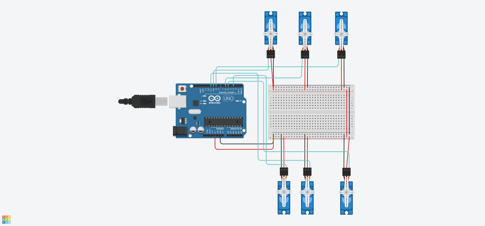

# 🔧 6 Servo Motor Control with Arduino



This project demonstrates how to control 6 servo motors using an Arduino Uno. The motors first sweep back and forth, then hold at 90°.

---

## 📌 What It Does

- Controls 6 servo motors using an Arduino
- Sweeps all motors for a few seconds
- Sets all motors to 90° and holds them
- Prepares for a simple walking motion

---

## 🧰 Components Used

- Arduino Uno  
- 6x Servo Motors  
- Breadboard  
- Jumper Wires  

---

## 📝 How It Works

Each servo is connected to a PWM digital pin on the Arduino (3, 5, 6, 9, 10, 11).

In `setup()`:
- Motors sweep from 0° to 180°
- Then return to 90°

In `loop()`:
- Motors stay fixed at 90°

## 🔧 Arduino Code

```cpp
#include <Servo.h>

Servo servo1, servo2, servo3, servo4, servo5, servo6;

void setup() {
  servo1.attach(3);
  servo2.attach(5);
  servo3.attach(6);
  servo4.attach(9);
  servo5.attach(10);
  servo6.attach(11);

  for (int angle = 0; angle <= 180; angle += 5) {
    servo1.write(angle);
    servo2.write(angle);
    servo3.write(angle);
    servo4.write(angle);
    servo5.write(angle);
    servo6.write(angle);
    delay(50);
  }

  servo1.write(90);
  servo2.write(90);
  servo3.write(90);
  servo4.write(90);
  servo5.write(90);
  servo6.write(90);
}

void loop() {
  // Do nothing
}
